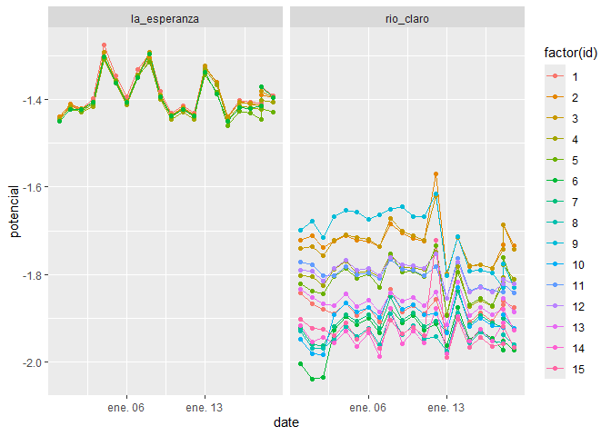
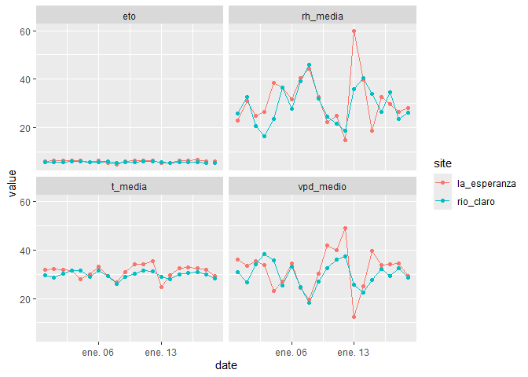
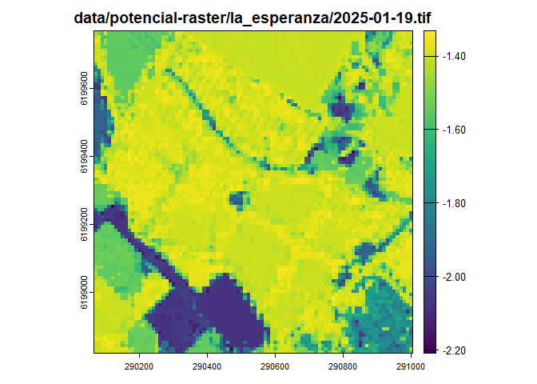
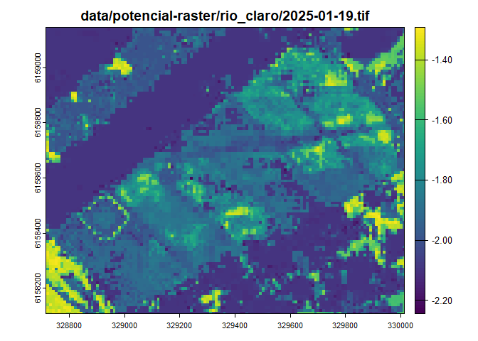

::: cell
``` {.r .cell-code}
library(ggplot2)
```
:::

::::: cell
``` {.r .cell-code}
dpot <- readr::read_csv("data/potencial-csv/potencial-sites.csv")
```

::: {.cell-output .cell-output-stderr}
    Rows: 441 Columns: 4
    ── Column specification ────────────────────────────────────────────────────────
    Delimiter: ","
    chr  (1): site
    dbl  (2): id, potencial
    date (1): date

    ℹ Use `spec()` to retrieve the full column specification for this data.
    ℹ Specify the column types or set `show_col_types = FALSE` to quiet this message.
:::

``` {.r .cell-code}
ggplot(dpot, aes(date, potencial, color = factor(id), group = id)) +
  geom_line() +
  geom_point() +
  facet_wrap(vars(site))
```

::: cell-output-display

:::
:::::

:::::: cell
``` {.r .cell-code}
dcli <- readr::read_csv("data/climate/climate-sites.csv") 
```

::: {.cell-output .cell-output-stderr}
    Rows: 42 Columns: 6
    ── Column specification ────────────────────────────────────────────────────────
    Delimiter: ","
    chr  (1): site
    dbl  (4): eto, vpd_medio, t_media, rh_media
    date (1): date

    ℹ Use `spec()` to retrieve the full column specification for this data.
    ℹ Specify the column types or set `show_col_types = FALSE` to quiet this message.
:::

``` {.r .cell-code}
dcli |> 
  tidyr::pivot_longer(cols = -c(site, date)) |> 
  ggplot(aes(date, value, color = site, group = site)) +
  geom_line() +
  geom_point() +
  facet_wrap(vars(name)) 
```

::: {.cell-output .cell-output-stderr}
    Warning: Removed 2 rows containing missing values or values outside the scale range
    (`geom_point()`).
:::

::: cell-output-display

:::
::::::

:::: cell
``` {.r .cell-code}
f <- fs::dir_ls("data/potencial-raster/la_esperanza/") |> 
  dplyr::last()

terra::rast(f) |> 
  terra:::plot(main = f)
```

::: cell-output-display

:::
::::

:::: cell
``` {.r .cell-code}
f <- fs::dir_ls("data/potencial-raster/rio_claro/") |> 
  dplyr::last()

terra::rast(f) |> 
  terra:::plot(main = f)
```

::: cell-output-display

:::
::::
