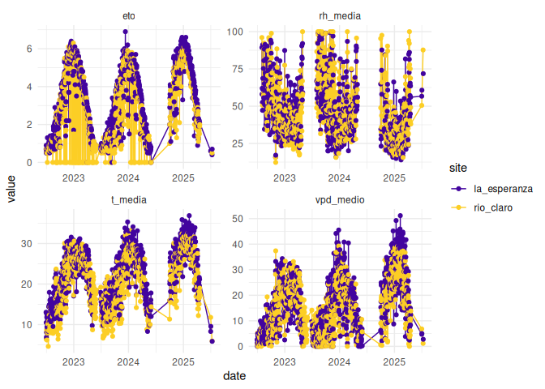
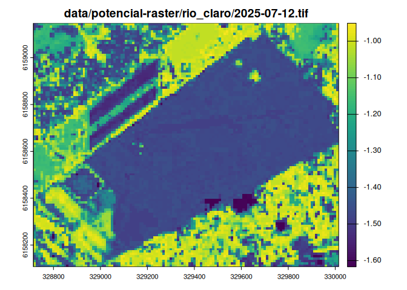

# Readme


``` r
library(ggplot2)

Sys.time()
```

    [1] "2026-02-07 01:05:33 UTC"

``` r
dpot <- readr::read_csv("data/potencial-csv/potencial-sites.csv", show_col_types = FALSE)

ggplot(dpot, aes(date, potencial, color = factor(id), group = id)) +
  geom_line() +
  geom_point() +
  scale_color_viridis_d(option = "C", begin = .1, end = .9) + 
  facet_wrap(vars(site), scales = "free") +
  theme_minimal()
```


``` r
dcli <- readr::read_csv("data/climate/climate-sites.csv", show_col_types = FALSE) 

dcli |> 
  tidyr::pivot_longer(cols = -c(site, date)) |> 
  ggplot(aes(date, value, color = site, group = site)) +
  geom_line() +
  geom_point() +
  scale_color_viridis_d(option = "C", begin = .1, end = .9) + 
  facet_wrap(vars(name), scales = "free") +
  theme_minimal()
```

    Warning: Removed 47 rows containing missing values or values outside the scale range
    (`geom_line()`).

    Warning: Removed 197 rows containing missing values or values outside the scale range
    (`geom_point()`).



``` r
f <- fs::dir_ls("data/potencial-raster/la_esperanza/") |> 
  dplyr::last()

terra::rast(f) |> 
  terra:::plot(main = f)
```


``` r
f <- fs::dir_ls("data/potencial-raster/rio_claro/") |> 
  dplyr::last()

terra::rast(f) |> 
  terra:::plot(main = f)
```


